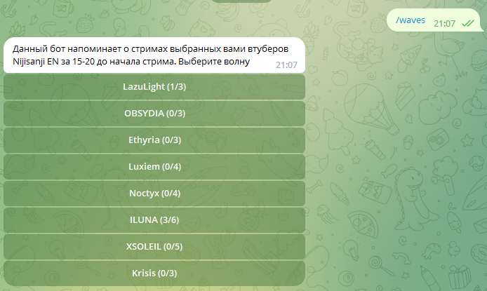
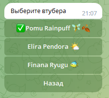
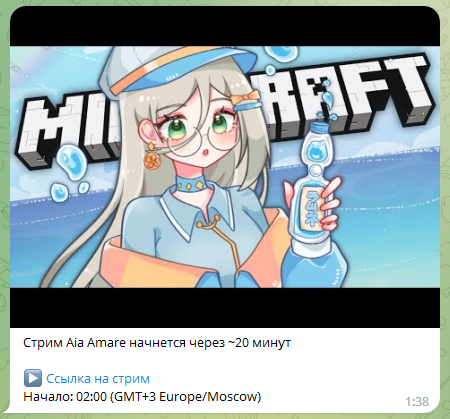

# melatonin-bot

melatonin-bot is a Telegram bot that reminds users about streams of selected NijiEN livers in ~20 minutes. It's built with the [MOBOT](https://github.com/0xfe/mobot)
Telegram API framework.

## Try it out

You can try out melatonin-bot by starting a chat with [@mmelatonin_bot](https://t.me/mmelatonin_bot).

## Usage

Set configuration file `dev.json` and waves-data file `data.json` and run the bot.

### Configuration files
`dev.json`

```json
{
    "holodex_api_key" : "<api-key>",
    "telegram_bot_token" : "<api-key>",
    "sql_connection_string" : "<connection-string>",
    "startup_data_path" : "<path-to-data>",
    "max_connections" : <max-connections-amount>,
    "timer_duration_sec" : <duration-in-seconds>
}
```

`data.json`

```json
{
    "waves": [
        {
            "name": "LazuLight",
            "members": [
                {
                    "first_name": "Pomu",
                    "last_name": "Rainpuff",
                    "emoji": "🧚🍂",
                    "youtube_channel_id": "UCP4nMSTdwU1KqYWu3UH5DHQ",
                    "youtube_handle": "@pomurainpuff"
                }
            ]
        }
    ]
}
```

### Screenshots

Waves:



Members of the wave:



Notification:



#### Notes
* For now i'm using my [mobot fork](https://github.com/DanArmor/mobot), where i've implemented `sendPhoto` function. It will change, when sendPhoto became stable.
* Why *melatonin*? I got the idea after look at NijiEn-themed tg-channel named [insomnia](https://t.me/nijisanjiensomnia) - and that name came to mind.